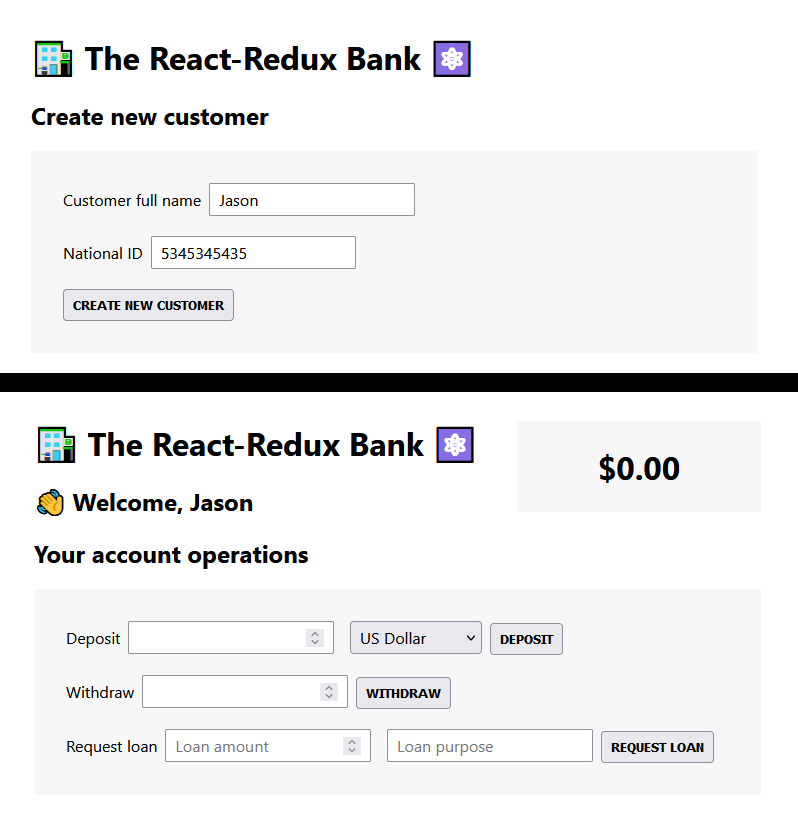

# React (Redux) - bank app

# 🔗 [Live Preview](https://main--aesthetic-lamington-f4a75b.netlify.app/)

---

## About Project 👋

This small practice app's main goal is to practice using managing global state using redux toolkit and vanilla redux. It allows users to deposit or withdraw money, request and repay loans into their bank accounts. It also supports simple customer creation, so new users can quickly set up their accounts.

Created using create-react-app

---

## Features 👨‍💻

- **Create New Customer:** Enter your full name and national ID to create a new customer profile. This is the first step before accessing any account operations.

  - **Account Operations:**

  - **Deposit Money:** Add money to your account in different currencies, and it will be automatically converted to USD.

  - **Withdraw Money:** Take money out of your account at any time.

  - **Request a Loan:** Apply for a loan by specifying the amount and purpose. If approved, the loan amount will be added to your balance.

  - **Pay Back Loan:** Repay your loan once you have the funds available.

  - **Balance Display:** Always stay informed about your account balance, displayed in USD for easy understanding.

  - **Asynchronous Actions:** Handle asynchronous operations such as fetching currency conversion rates with redux-thunk.

---

## Components and Redux Slices ⚙️

-   **App Component:**

    -   The main entry point of the application.
    -   Renders either the customer creation form or the banking interface depending on whether a customer is created.
    -   Uses `useSelector` to fetch the customer's full name from the Redux store.-   **CreateCustomer Component:**

    -   A form for creating a new customer.
    -   Dispatches the `createCustomer` action to update the Redux store with the new customer's details.
    -   Fields: `fullName`, `nationalID`.-   **Customer Component:**

    -   Displays a welcome message to the customer.
    -   Uses `useSelector` to retrieve the customer's full name from the Redux store.
    -   **AccountOperations Component:**

    -   Allows the user to perform various account-related operations:
        -   **Deposit:** Deposits a specified amount of money in a selected currency. If the currency is not USD, it converts the amount to USD using an external API.
        -   **Withdraw:** Withdraws a specified amount of money from the account.
        -   **Request Loan:** Requests a loan with a specified amount and purpose. A loan can only be requested if there is no outstanding loan.
        -   **Pay Loan:** Pays off the current loan.
    -   Uses `useSelector` to fetch the current loan status and `useDispatch` to trigger Redux actions.-   **BalanceDisplay Component:**

    -   Displays the current account balance formatted as currency.
    -   Uses `connect` to map the account balance from the Redux store to the component props.

### State Management

- **Redux Store:**

- **Account Slice:**

  - **State:** Manages the account's balance, loan amount, loan purpose, and loading state for currency conversion.

  - **Actions:**
    - **deposit:** Adds the deposited amount to the balance. If a currency conversion is required, it triggers an async action.

    - **withdraw:** Subtracts the specified amount from the balance.

    - **requestLoan:** Grants a loan and adds the loan amount to the balance, provided there is no existing loan.

    - **payLoan:** Pays off the current loan by subtracting the loan amount from the balance.

    - **convertingCurrency:** Updates the loading state while waiting for currency conversion.

  - **Async Thunk:**

    - `deposit`: Handles the conversion of foreign currency deposits to USD by making an API call to `https://api.frankfurter.app`.- **Customer Slice:**

  - **State:** Stores the customer's full name, national ID, and account creation date.
  - **Actions:**
    - **createCustomer:** Creates a new customer with the specified details.

    - **updateName:** Updates the customer's name.

This structure allows for efficient and centralized management of the app's state, making it easy to track and update account and customer information as needed.

---

## Technologies & Dependencies used 📦

- **React:** components, conditionals, functions...

- **Redux:** store, slices, reducers

- **Styling:** basic CSS

dependencies:

- "@reduxjs/toolkit": "^2.2.7",
- "@testing-library/jest-dom": "^5.17.0",
- "@testing-library/react": "^13.4.0",
- "@testing-library/user-event": "^13.5.0",
- "react": "^18.3.1",
- "react-dom": "^18.3.1",
- "react-redux": "^9.1.2",
- "react-scripts": "5.0.1",
- "redux": "^5.0.1",
- "redux-thunk": "^3.1.0",
- "web-vitals": "^2.1.4"

devDependencies:

-  "@babel/plugin-proposal-private-property-in-object": "^7.21.11",
-  "@babel/plugin-transform-private-property-in-object": "^7.24.7"

---

## Prerequisites 📚

Ensure you have the following installed on your system:

    Node.js v18.00.0
    npm or yarn

---

## Clone & Run locally 🏃‍♂️

1. **Clone the Repository:**

   - On the GitHub repo page, click the green "Code" button.

   - Copy the HTTPS URL.

2. **Open the Terminal:**

   - Open the terminal by typing "cmd" in your desktop's start menu, **OR**

   - Right-click on the desktop and select "Git Bash Here" (if you have Git Bash installed), **OR**

   - Open Visual Studio Code's terminal by clicking "Terminal" -> "New Terminal" inside the editor.

3. **Navigate to Your Project Location:**

   - In the terminal, navigate to your desired location (e.g., desktop) using the command: `cd desktop`. Adjust the path if your project is located elsewhere.

   - Ensure that your terminal's address is inside the project folder.

4. **Clone the Repository:**

   - Run the command: `git clone /link/`. Replace `/link/` with the HTTPS URL from step 1.

5. **Enter the Project Directory:**

   - Navigate into the cloned repository by typing: `cd /folder-name/`. Replace `/folder-name/` with the name of the cloned folder.

6. **Install Dependencies:**

   - Run the command: `npm install` to install all the necessary dependencies.

7. **Start the Project:**

   - Run the command: `npm start` or `yarn start` to start the project. It will open in your default browser at [localhost:3000/](http://localhost:3000/)

---

## Project Structure 📂

    project-name
    ├── public
    ├── src
    │ ├── features
    │ │ ├── account
    │ │ │   ├── AccountOperations.js
    │ │ │   ├── accountSlice.js
    │ │ │   ├── BalanceDisplay.js
    │ │ ├── customers
    │ │ │   ├── createCustomer.js
    │ │ │   ├── customer.js
    │ │ │   ├── customerSlice.js
    │ ├── App.js
    │ ├── index.css
    │ ├── index.js
    │ ├── store-v1
    │ ├── store-v2
    │ ├── store.js
    ├── package.json
    └── README.md

---

## Contributing 💻

Contributions are closed.
